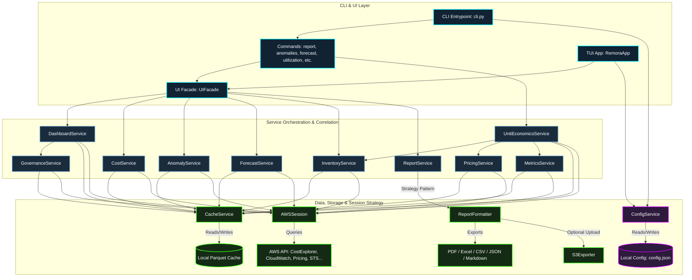

# 🦈 Remora-Fin: High-Performance AWS FinOps CLI

[](https://github.com/AlexDcoder/remora-fin/actions/workflows/ci.yml)
[](https://github.com/AlexDcoder/remora-fin/actions)
[](https://pypi.org/project/remora-fin/)

**Remora-Fin** is a lightweight, high-performance FinOps toolkit for AWS. Built with Polars and Textual, it attaches to your AWS environment to analyze spending, detect anomalies, and export professional-grade reports.

---

## 🏁 Getting Started

Get up and running in seconds:

1. **Install** Remora-Fin:
   ```bash
   uv tool install remora-fin
   ```
2. **Configure** your AWS credentials interactively:
   ```bash
   remora-fin login
   ```
3. **Launch** the interactive dashboard:
   ```bash
   remora-fin dashboard
   ```

---

## 🚀 Key Features

* **📈 Vector Graphics:** Native PDF visualizations (Bars & Lines) with zero external dependencies.
* **📂 High-Speed Analysis:** Powered by **Polars** for near-instant processing of large billing datasets.
* **🔍 Anomaly Intelligence:** Identify unexpected cost spikes using AWS Cost Explorer algorithms.
* **🔮 Predictive Analysis:** Integrated spending forecasts to avoid end-of-month surprises.
* **📉 Efficiency & Unit Economics:** Correlate cost with real-world utilization metrics (CPU, Memory, I/O) to identify waste and right-sizing opportunities.
* **🖥️ Terminal UI:** Interactive dashboard (TUI) with a high-performance **UI Facade** and internal caching for ultra-responsive navigation.
* **🏗️ Registry Architecture:** Dynamically managed AWS inventory via a centralized resource registry, making it easy to extend monitoring to new services.
* **🔒 Privacy First:** All data processing happens locally on your machine. Remora-Fin never sends your billing data to external servers.
* **📊 Smart Service Normalization:** Automatically maps and normalizes AWS service names (e.g., "EC2-Other" → "EC2-Other") for cleaner, more intuitive dashboard displays.

---

## 📊 Service Coverage & Checklist

Remora-Fin provides deep visibility into your AWS environment. Below is the checklist of active integrations and their supported FinOps depth.

| AWS Service | Status | Tracking | Pricing | Cost Calc |
| :--- | :---: | :---: | :---: | :---: |
| **Compute** | | | | |
| EC2 Instances | **Active** | ✅ | ✅ | ✅ |
| Lambda Functions | **Active** | ✅ | ✅ | ✅ |
| ECS Clusters | **Active** | ✅ | ✅ | ✅ |
| EKS Clusters | **Active** | ✅ | ✅ | ✅ |
| App Runner | **Active** | ✅ | ✅ | ✅ |
| **Storage** | | | | |
| S3 Buckets | **Active** | ✅ | ✅ | ✅ |
| EBS Volumes | **Active** | ✅ | ✅ | ✅ |
| EFS File Systems | **Active** | ✅ | ✅ | ✅ |
| ECR (Container Registry) | **Coming Soon** | - | - | - |
| S3 Glacier / Deep Archive | **Coming Soon** | - | - | - |
| FSx (all types) | **Coming Soon** | - | - | - |
| Storage Gateway | **Coming Soon** | - | - | - |
| AWS Backup | **Coming Soon** | - | - | - |
| **Databases** | | | | |
| RDS Instances | **Active** | ✅ | ✅ | ✅ |
| DynamoDB Tables | **Active** | ✅ | ✅ | ✅ |
| ElastiCache | **Active** | ✅ | ✅ | ✅ |
| Redshift | **Active** | ✅ | ✅ | ✅ |
| OpenSearch Service | **Active** | ✅ | ✅ | ✅ |
| Aurora (Serverless & Provisioned) | **Coming Soon** | - | - | - |
| DocumentDB | **Coming Soon** | - | - | - |
| Neptune | **Coming Soon** | - | - | - |
| Timestream | **Coming Soon** | - | - | - |
| Keyspaces | **Coming Soon** | - | - | - |
| **Networking** | | | | |
| CloudFront | **Active** | ✅ | ✅ | ✅ |
| ELB (v2) | **Active** | ✅ | ✅ | ✅ |
| NAT Gateway | **Active** | ✅ | ✅ | ✅ |
| Route 53 | **Active** | ✅ | ✅ | ✅ |
| VPC / Subnets | **Active** | ✅ | - | - |
| Global Accelerator | **Coming Soon** | - | - | - |
| Direct Connect | **Coming Soon** | - | - | - |
| Site-to-Site VPN | **Coming Soon** | - | - | - |
| PrivateLink | **Coming Soon** | - | - | - |
| Network Firewall | **Coming Soon** | - | - | - |
| Shield Advanced | **Coming Soon** | - | - | - |
| **App Integration** | | | | |
| SNS Topics | **Active** | ✅ | ✅ | ✅ |
| SQS Queues | **Active** | ✅ | ✅ | ✅ |
| Step Functions | **Active** | ✅ | ✅ | ✅ |
| EventBridge | **Active** | ✅ | - | - |
| Amazon MQ | **Coming Soon** | - | - | - |
| AppFlow | **Coming Soon** | - | - | - |
| **Serverless & API** | | | | |
| API Gateway (v1/v2) | **Active** | ✅ | ✅ | ✅ |
| AppSync | **Coming Soon** | - | - | - |
| **Analytics & ML** | | | | |
| EMR Clusters | **Active** | ✅ | ✅ | ✅ |
| SageMaker | **Active** | ✅ | ✅ | ✅ |
| Glue | **Active** | ✅ | ✅ | ✅ |
| Athena | **Coming Soon** | - | - | - |
| Kinesis (Streams / Firehose) | **Coming Soon** | - | - | - |
| MSK (Managed Kafka) | **Coming Soon** | - | - | - |
| Bedrock | **Coming Soon** | - | - | - |
| Rekognition | **Coming Soon** | - | - | - |
| Lex | **Coming Soon** | - | - | - |
| Polly | **Coming Soon** | - | - | - |
| Transcribe | **Coming Soon** | - | - | - |
| Comprehend | **Coming Soon** | - | - | - |
| Textract | **Coming Soon** | - | - | - |
| **Management** | | | | |
| KMS Keys | **Active** | ✅ | ✅ | ✅ |
| Secrets Manager | **Active** | ✅ | ✅ | ✅ |
| Transfer Family | **Active** | ✅ | ✅ | ✅ |
| IAM Roles | **Active** | ✅ | - | - |
| CloudTrail | **Coming Soon** | - | - | - |
| Config | **Coming Soon** | - | - | - |
| Systems Manager (Parameter Store) | **Coming Soon** | - | - | - |
| **Security & Logs** | | | | |
| WAF v2 | **Active** | ✅ | ✅ | ✅ |
| CloudWatch Logs | **Active** | ✅ | - | - |
| **Developer Tools** | | | | |
| CodeBuild | **Coming Soon** | - | - | - |
| CodePipeline | **Coming Soon** | - | - | - |
| CodeDeploy | **Coming Soon** | - | - | - |
| CodeArtifact | **Coming Soon** | - | - | - |
| **Migration** | | | | |
| DMS (Database Migration) | **Coming Soon** | - | - | - |
| **IoT & Hosting** | | | | |
| IoT Core | **Coming Soon** | - | - | - |
| Amplify (Hosting) | **Coming Soon** | - | - | - |

---

## 🏗️ Architecture

### System Data Flow



### Class Relationships (UML Diagram)

```mermaid
classDiagram
    %% Core Infrastructure
    class AWSSession {
        +get_instance() AWSSession
        +cost_explorer() Paginator
        +pricing() Paginator
        +cloudwatch() Client
    }

    class CacheService {
        +get(query, max_age_hours) DataFrame
        +set(query, df)
        +get_json(query, max_age_hours) Any
        +set_json(query, data)
    }

    class BaseService {
        #_session: AWSSession
        #_cache: CacheService
    }
    BaseService --> AWSSession
    BaseService --> CacheService

    %% Configuration Management
    class ConfigService {
        +settings AppSettings
        +get_aws_profile() str
        +get_default_region() str
        +save_config(settings)
        +is_configured() bool
    }
    class ConfigBuilder {
        +with_aws_profile(profile) ConfigBuilder
        +with_region(region) ConfigBuilder
        +with_role_arn(role_arn) ConfigBuilder
        +with_cache_enabled(enabled) ConfigBuilder
        +with_cache_ttl(ttl) ConfigBuilder
        +with_theme(theme) ConfigBuilder
        +build() AppSettings
    }
    ConfigService <.. ConfigBuilder : builds

    %% Domain Services
    class CostService {
        +get_cost_by_service_async() CostBreakdown
        +normalize_service_name(name) str
    }
    class AnomalyService {
        +get_anomaly_report() AnomalyReport
    }
    class ForecastService {
        +get_forecast_result() ForecastResult
    }
    class PricingService {
        +get_ec2_price() PricingDetail
        +get_s3_price() PricingDetail
    }
    class MetricsService {
        +get_ec2_cpu_utilization() CPUSummary
    }
    class InventoryService {
        +list_resources_async() list
    }
    class GovernanceService {
        +get_tag_compliance(required_tags, use_cache) dict
        +get_tag_compliance_async(required_tags, use_cache) dict
        +list_organization_accounts() list
    }

    CostService --|> BaseService
    AnomalyService --|> BaseService
    ForecastService --|> BaseService
    PricingService --|> BaseService
    MetricsService --|> BaseService
    InventoryService --|> BaseService
    GovernanceService --|> BaseService

    %% Orchestrated & Correlated Services
    class UnitEconomicsService {
        -_inventory: InventoryService
        -_pricing: PricingService
        -_metrics: MetricsService
        +get_ec2_efficiency() list
        +get_s3_efficiency() list
    }
    UnitEconomicsService --|> BaseService
    UnitEconomicsService --> InventoryService
    UnitEconomicsService --> PricingService
    UnitEconomicsService --> MetricsService

    class DashboardService {
        -_cost: CostService
        -_anomaly: AnomalyService
        -_forecast: ForecastService
        -_inventory: InventoryService
        -_governance: GovernanceService
    }
    DashboardService --|> BaseService
    DashboardService --> CostService
    DashboardService --> AnomalyService
    DashboardService --> ForecastService
    DashboardService --> InventoryService
    DashboardService --> GovernanceService

    %% UI Components
    class UIFacade {
        -_dashboard_service: DashboardService
        -_cost_service: CostService
        -_anomaly_service: AnomalyService
        -_forecast_service: ForecastService
        -_inventory_service: InventoryService
        +get_dashboard_data() DashboardUIData
        +get_cost_data() list
    }
    UIFacade --> DashboardService
    UIFacade --> CostService
    UIFacade --> AnomalyService
    UIFacade --> ForecastService
    UIFacade --> InventoryService

    class RemoraApp {
        -_facade: UIFacade
        -_session: AWSSession
        +on_mount()
    }
    RemoraApp --> UIFacade
    RemoraApp --> AWSSession

    %% Reporting & Export Strategy
    class ReportService {
        -_formatters: dict
        +generate_report()
    }
    class ReportFormatter {
        <<interface>>
        +format_cost()*
        +format_anomalies()*
        +format_forecast()*
    }
    class PDFFormatter {
        +format_cost()
    }
    class ExcelFormatter {
        +format_cost()
    }
    class MarkdownFormatter {
        +format_cost()
    }
    class FastTableFormatter {
        +format_cost()
    }
    class S3Exporter {
        +upload() str
    }

    ReportService --> ReportFormatter
    ReportService --> S3Exporter
    PDFFormatter --|> ReportFormatter
    ExcelFormatter --|> ReportFormatter
    MarkdownFormatter --|> ReportFormatter
    FastTableFormatter --|> ReportFormatter
```



---

## 📦 Installation

Install Remora-Fin using `pip` or `uv`:

```bash
# Using uv (Recommended)
uv tool install remora-fin

# Using pip
pip install remora-fin
```

---

## 🔐 IAM Permissions

Remora-Fin requires **read-only** access to AWS Cost Explorer, Organizations, and various resource metadata for the dashboard inventory.

### Option 1: Managed Policy (Recommended)
Attach the AWS managed policy **`ReadOnlyAccess`** to your IAM user or role. This is the simplest way to ensure all features work correctly.

### Option 2: Granular Permissions
If you prefer a least-privilege approach, ensure your IAM identity has the following permissions:

| Service | Action | Purpose |
| --- | --- | --- |
| **Cost Explorer** | `ce:GetCostAndUsage` | Cost reports and trends. |
| | `ce:GetAnomalies` | Cost spike detection and monitor access. |
| | `ce:GetCostForecast` | Native spend projections. |
| **Security Token** | `sts:GetCallerIdentity` | Current account and user identification. |
| **Organizations** | `organizations:ListAccounts` | Multi-account environment support. |
| **Tagging** | `tag:GetResources` | Governance and tag compliance scoring. |
| **Pricing** | `pricing:GetProducts` | Real-time unit price lookups for right-sizing. |
| **Metrics** | `cloudwatch:GetMetricStatistics` | Resource utilization analysis. |
| **Inventory** | `ec2:DescribeInstances` | EC2 Instance tracking. |
| | `s3:ListAllMyBuckets` | S3 Bucket inventory. |
| | `rds:DescribeDBInstances` | RDS Database tracking. |
| | `lambda:ListFunctions` | Serverless function monitoring. |
| | `cloudfront:ListDistributions` | Edge delivery tracking. |
| | `dynamodb:ListTables` | NoSQL table inventory. |
| | `elasticache:DescribeCacheClusters` | In-memory cache tracking. |
| | `elasticmapreduce:ListClusters` | Big data cluster inventory. |
| | `redshift:DescribeClusters` | Data warehouse tracking. |
| | `sagemaker:ListNotebookInstances` | ML notebook monitoring. |
| | `ecs:ListClusters` | Container cluster inventory. |
| | `eks:ListClusters` | Kubernetes cluster inventory. |
| | `apprunner:ListServices` | App Runner service tracking. |
| | `states:ListStateMachines` | Step Functions monitoring. |
| | `glue:GetDatabases` | Data catalog inventory. |
| | `transfer:ListServers` | Transfer Family tracking. |
| | `sns:ListTopics` | Pub/Sub topic inventory. |
| | `sqs:ListQueues` | Message queue tracking. |
| | `kms:ListKeys` | KMS Key tracking. |
| | `secretsmanager:ListSecrets` | Secrets Manager tracking. |
| | `ec2:DescribeVolumes` | EBS Volume tracking. |
| | `efs:DescribeFileSystems` | EFS File System tracking. |
| | `elbv2:DescribeLoadBalancers` | ELB Load Balancer tracking. |
| | `ec2:DescribeNatGateways` | NAT Gateway tracking. |

---

## 🛠️ Commands & Usage

### 📊 `report`

Generate comprehensive cost and usage reports.

| Argument | Shortcut | Type / Choices | Default | Description |
| --- | --- | --- | --- | --- |
| `--type` | `-t` | `breakdown`, `trend`, `account`, `full` | `full` | Report type. |
| `--format` | `-f` | `pdf`, `excel`, `csv`, `markdown`, `json` | `pdf` | Output format. |
| `--days` | `-d` | `int` | `30` | Lookback period in days. |
| `--start` | | `YYYY-MM-DD` | | Start date. |
| `--end` | | `YYYY-MM-DD` | | End date. |
| `--metric` | | `UnblendedCost`, `BlendedCost`, `NetUnblendedCost`, `AmortizedCost`, `UsageQuantity` | `UnblendedCost` | Cost metric. |
| `--group-by` | | `SERVICE`, `LINKED_ACCOUNT`, `REGION`, `USAGE_TYPE` | | Group results by dimension. |
| `--service` | `-s` | `string` | | Filter by one or more AWS services (e.g., `ec2 s3`). Supports smart aliases. |
| `--include-charts` | | flag | `True` | Include visual charts in the report. |
| `--chart-labels` | | flag | `True` | Show minimalistic X and Y axis values on charts. |
| `--output` | `-o` | `path` | | Output file path. |
| `--profile` | `-p` | `string` | | AWS profile name. |
| `--region` | `-r` | `string` | | AWS region. |

```bash
# Generate a monthly breakdown in PDF for the last 30 days
remora-fin report --type breakdown --format pdf --output monthly_report.pdf

# Generate a dedicated report for EC2 and S3 with axis labels
remora-fin report --service ec2 s3 --type full --format pdf --chart-labels

# Export cost data in JSON format for external analysis
remora-fin report --type trend --format json --days 60

# Generate an Excel report of daily trends for a specific date range, grouped by AWS service
remora-fin report --type trend --format excel --start 2026-06-01 --end 2026-06-15 --group-by SERVICE --output june_service_trend.xlsx

# Generate a Markdown summary report for a specific AWS account using amortized cost
remora-fin report --type account --format markdown --days 90 --metric AmortizedCost --profile prod-account

# Generate a detailed CSV cost breakdown for all networking services (using aliases)
remora-fin report --service cloudfront route53 elbv2 --type breakdown --format csv --days 30 --output networking_costs.csv
```

#### 💡 Cost & Cache Considerations for Reporting

AWS charges **$0.01 per request** made to the Cost Explorer API (`GetCostAndUsage`). To protect you from unexpected AWS billing charges during active exploration, Remora-Fin uses an automatic caching mechanism:
*   **Parquet Cache Storage**: Query responses are parsed into Polars DataFrames and stored locally in `~/.remora/cache/` using a SHA-256 hash of the query parameters.
*   **Cache Expiration**: Local cached DataFrames are retained for **24 hours**. Any identical command or dashboard refresh run within this window will load instantly from disk at **zero AWS cost**.
*   **Cache Management**: You can inspect or purge your cache at any time using:
    ```bash
    # Show cache usage
    remora-fin cache info

    # Clear cache files
    remora-fin cache clear
    ```

#### 📈 Selecting the Right Cost Metric

When running reports, you can specify different `--metric` options to view costs under various financial models:

| Metric Name | Cost Explorer API Field | Description |
| :--- | :--- | :--- |
| **`UnblendedCost`** *(Default)* | `UnblendedCost` | The raw cost of usage on the day it occurred, calculated using the standard unblended rate. Does not include discounts, refunds, or credits. |
| **`BlendedCost`** | `BlendedCost` | The average cost of usage across all linked accounts in an AWS Organization (useful for consolidated billing). |
| **`AmortizedCost`** | `AmortizedCost` | Spreads upfront reservation fees (RI/Savings Plans) evenly over the usage period, giving a more accurate view of daily baseline cost. |
| **`NetUnblendedCost`** | `NetUnblendedCost` | Unblended cost *after* factoring in post-billing discounts, credits, refunds, and support fees. |
| **`UsageQuantity`** | `UsageQuantity` | The raw usage volume (e.g. GB stored, hours run) instead of monetary cost. |

---

### 💾 `cache`

Inspect or clear the local Parquet/JSON cache used to speed up analysis.

| Argument | Shortcut | Type / Choices | Default | Description |
| --- | --- | --- | --- | --- |
| `info` | | subcommand | | Show cache directory, total files, and size. |
| `clear` | | subcommand | | Purge all files in the cache directory immediately. |

```bash
# Show cache statistics (path, count, size)
remora-fin cache info

# Clear cache manually to force fresh queries on next run
remora-fin cache clear
```

---

### 🔍 `anomalies`

Detect and display AWS cost anomalies using ML-based detection.

| Argument | Shortcut | Type / Choices | Default | Description |
| --- | --- | --- | --- | --- |
| `--days` | `-d` | `int` | `30` | Lookback period (max 90). |
| `--start` | | `YYYY-MM-DD` | | Start date. |
| `--end` | | `YYYY-MM-DD` | | End date. |
| `--severity` | | `low`, `medium`, `high`, `critical` | | Filter by severity. |
| `--monitor-arn` | | `string` | | Filter by specific monitor ARN. |
| `--detail` | | flag | | Show detailed anomaly list. |
| `--profile` | `-p` | `string` | | AWS profile name. |
| `--region` | `-r` | `string` | | AWS region. |

```bash
# Detect anomalies in the last 60 days
remora-fin anomalies --days 60 --severity high

# Search for critical anomalies over the past 90 days (maximum lookback)
remora-fin anomalies --days 90 --severity critical

# Query anomalies detected by a specific cost monitor with detailed outputs
remora-fin anomalies --monitor-arn arn:aws:ce:us-east-1:123456789012:anomalymonitor/96515f40-36df-48c0-8260-dc6a3f784e1b --detail

# Detect medium-to-critical anomalies in a specific region using a custom profile
remora-fin anomalies --days 30 --severity medium --profile billing-admin --region eu-west-1
```

---

### 🔮 `forecast`

Predict future AWS costs using ML-based forecasting.

| Argument | Shortcut | Type / Choices | Default | Description |
| --- | --- | --- | --- | --- |
| `--days` | `-d` | `int` | `30` | Days to forecast (max 365). |
| `--start` | | `YYYY-MM-DD` | | Forecast start date. |
| `--end` | | `YYYY-MM-DD` | | End date. |
| `--metric` | | `UnblendedCost`, `BlendedCost`, `NetUnblendedCost`, `AmortizedCost`, `UsageQuantity` | `UnblendedCost` | Metric to forecast. |
| `--granularity` | | `DAILY`, `MONTHLY` | `DAILY` | Forecast granularity. |
| `--group-by-type`| | `DIMENSION`, `TAG`, `COST_CATEGORY` | | Group forecast by type. |
| `--group-by-key` | | `SERVICE`, `LINKED_ACCOUNT`, `REGION`, `USAGE_TYPE`, `INSTANCE_TYPE`, `PLATFORM` | | Group forecast by key. |
| `--scenarios` | | flag | | Show what-if scenario analysis. |
| `--profile` | `-p` | `string` | | AWS profile name. |
| `--region` | `-r` | `string` | | AWS region. |

```bash
# Forecast next 30 days of spend
remora-fin forecast --days 30 --scenarios

# Run a 90-day forecast of Amortized Costs with monthly granularity
remora-fin forecast --days 90 --granularity MONTHLY --metric AmortizedCost

# Generate a 14-day daily forecast grouped by AWS service (using AWS dimensional grouping)
remora-fin forecast --days 14 --granularity DAILY --group-by-type DIMENSION --group-by-key SERVICE

# Show scenario analysis (optimistic, baseline, pessimistic) for a staging environment in us-west-2
remora-fin forecast --days 90 --scenarios --profile staging-profile --region us-west-2
```

---

### 🖥️ `dashboard`

Launch the interactive Terminal User Interface.

| Argument | Shortcut | Type / Choices | Default | Description |
| --- | --- | --- | --- | --- |
| `--days` | `-d` | `int` | | Default period in days. |
| `--theme` | | `dark`, `light` | | UI theme. |
| `--profile` | `-p` | `string` | | AWS profile name. |
| `--region` | `-r` | `string` | | AWS region. |

```bash
# Launch the TUI in dark theme with a 60-day default period
remora-fin dashboard --days 60 --theme dark

# Launch the TUI in light theme for a specific profile and region
remora-fin dashboard --days 90 --theme light --profile dev-developer --region us-west-2
```

---

### 📉 `utilization`

Analyze resource efficiency by correlating cost with CloudWatch metrics and Pricing API.

| Argument | Shortcut | Type / Choices | Default | Description |
| --- | --- | --- | --- | --- |
| `--days` | `-d` | `int` | `7` | Lookback period for metrics. |
| `--profile` | `-p` | `string` | | AWS profile name. |
| `--region` | `-r` | `string` | | AWS region. |

```bash
# Analyze EC2 efficiency for the last 7 days
remora-fin utilization --days 7

# Run resource utilization analysis over a longer 30-day window for right-sizing recommendations
remora-fin utilization --days 30

# Analyze EC2 metrics and pricing for a specific region and profile
remora-fin utilization --days 14 --profile staging-admin --region sa-east-1
```

---

### 🔐 `login`

Configure and test AWS credentials interactively.

| Argument | Shortcut | Type / Choices | Default | Description |
| --- | --- | --- | --- | --- |
| `--profile` | `-p` | `string` | | AWS profile name (skip interactive selection). |
| `--region` | `-r` | `string` | | AWS region (skip interactive selection). |

```bash
# Interactive configuration (AWS profiles and region selection lists)
remora-fin login

# Login using a specific profile and region directly (skips interactive selection)
remora-fin login --profile production-viewer --region us-west-2
```

---

### 👤 `profile`

View current remora-fin configuration and AWS session identity.

```bash
# View active remora-fin configuration and current AWS session caller identity / billing status
remora-fin profile

# View profile status when using a specific profile overriding configuration settings
remora-fin profile --profile backup-user --region eu-central-1
```

---

## 🤝 Contributing

Contributions are welcome!

1. Fork the Project
2. Create your Feature Branch (`git checkout -b feature/AmazingFeature`)
3. Commit your Changes (`git commit -m 'Add some AmazingFeature'`)
4. Push to the Branch (`git push origin feature/AmazingFeature`)
5. Open a Pull Request

---

## 🛠️ Development

Remora-Fin uses [uv](https://github.com/astral-sh/uv) for high-performance dependency management and multi-version Python testing.

### Testing across Python versions

You can easily run the test suite against different Python versions without manual installation:

```bash
# Test with Python 3.12 (Default)
uv run --python 3.12 pytest tests/

# Test with Python 3.13
uv run --python 3.13 pytest tests/
```

If a specific Python version is not found on your system, `uv` will automatically download and manage it for you.

---

## 📝 License

Distributed under the MIT License. See [`LICENSE`](LICENSE) for more information.