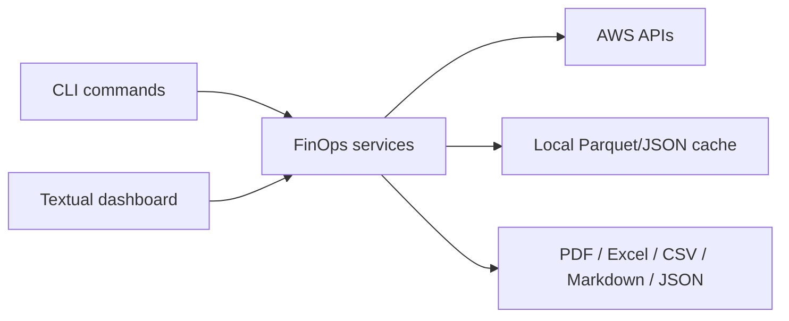

# 🦈 Remora-Fin: AWS FinOps CLI and Terminal Dashboard

[](https://github.com/AlexDcoder/remora-fin/actions/workflows/ci.yml)
[](https://pypi.org/project/remora-fin/)

Remora-Fin is a local-first Python toolkit for exploring AWS costs and resource efficiency from the terminal. It combines AWS Cost Explorer, CloudWatch, Pricing, Resource Groups Tagging API, and inventory APIs into a CLI and interactive Textual dashboard.

It is designed for engineers and FinOps practitioners who want cost visibility without exporting billing data to a third-party service. AWS data is queried directly from the configured profile; local configuration and cached query results are stored under `~/.remora/`.

## What it does

- Generate cost reports in PDF, Excel, CSV, Markdown, and JSON.
- Break down spend by service or linked account, or view daily trends.
- Retrieve AWS Cost Explorer anomaly findings and their root-cause details.
- Request AWS-native Cost Explorer forecasts, with local fallback and scenario comparisons.
- Launch an interactive Textual dashboard for cost summaries, trends, anomalies, infrastructure counts, and tag compliance.
- Evaluate tag compliance for required tags such as `Environment`, `Project`, and `Owner`.
- Inventory selected AWS resource types and correlate EC2, RDS, Lambda, and S3 data with CloudWatch metrics and AWS Pricing data for efficiency analysis.
- Cache AWS responses locally as Parquet and JSON files to speed up repeated queries and reduce API calls.

> Forecasts and anomaly findings come from AWS Cost Explorer. Remora-Fin presents and enriches that data; it does not train or host a separate machine-learning model.

## Quick start

Requirements: Python 3.12 or 3.13, an AWS CLI profile or other boto3-supported credentials, and read access to the AWS APIs used below.

```bash
# Install from PyPI
uv tool install remora-fin

# Select and validate an AWS profile and region
remora-fin login

# Open the terminal dashboard
remora-fin dashboard
```

With `pip`:

```bash
pip install remora-fin
```

## Commands

| Command | Purpose |
| --- | --- |
| `remora-fin dashboard` | Open the interactive terminal dashboard. |
| `remora-fin report` | Generate a cost or full FinOps report. |
| `remora-fin anomalies` | View AWS Cost Explorer anomaly findings. |
| `remora-fin forecast` | Forecast AWS spend and optionally compare scenarios. |
| `remora-fin utilization` | Analyze resource utilization and unit-pricing signals. |
| `remora-fin profile` | Display the selected profile and AWS identity. |
| `remora-fin login` | Configure and validate a profile and region. |
| `remora-fin cache info\|clear` | Inspect or clear the local cache. |

### Common examples

```bash
# Full 30-day report with costs, anomalies, forecast, infrastructure, and governance
remora-fin report --type full --format pdf --output remora-fin-report.pdf

# Cost trend grouped by AWS service
remora-fin report --type trend --days 60 --group-by SERVICE --format excel

# Inspect recent AWS Cost Explorer anomaly findings
remora-fin anomalies --days 30 --severity high

# Forecast the next 90 days and compare scenarios
remora-fin forecast --days 90 --granularity MONTHLY --scenarios

# Check EC2, RDS, Lambda, and S3 efficiency signals over 14 days
remora-fin utilization --days 14
```

Run `remora-fin <command> --help` for all options.

## Report formats and contents

`report` supports `breakdown`, `trend`, `account`, and `full` report types. A full report can combine:

- service-level cost breakdown and daily trend;
- AWS Cost Explorer anomaly findings and forecasts;
- selected infrastructure inventory counts;
- tag-compliance results;
- EC2 and S3 unit-economics information when AWS metrics and pricing data are available.

Supported export formats are PDF, Excel (`.xlsx`), CSV, Markdown, and JSON. An optional S3 exporter is available in the report service for workflows that need to upload a generated report.

## AWS inventory coverage

The inventory registry currently supports the following resource types:

| Category | Resource types |
| --- | --- |
| Compute and containers | EC2, Lambda, ECS, EKS |
| Storage and networking | S3, VPC |
| Databases and analytics | RDS, DynamoDB, ElastiCache, EMR, Redshift |
| ML and security | SageMaker notebook instances, KMS keys, Secrets Manager secrets |
| Messaging and edge | SNS topics, SQS queues, CloudFront distributions |

Coverage is intentionally stated at the resource-inventory level. Pricing, metrics, and efficiency recommendations vary by resource type and AWS API availability.

## AWS permissions

Use a dedicated, least-privilege IAM role or profile. At minimum, enable the capabilities you intend to use:

| Capability | AWS actions |
| --- | --- |
| Cost reporting | `ce:GetCostAndUsage`, `ce:GetCostForecast`, `ce:GetAnomalies` |
| Identity | `sts:GetCallerIdentity` |
| Governance | `tag:GetResources`, optionally `organizations:ListAccounts` |
| Metrics and pricing | `cloudwatch:GetMetricStatistics`, `pricing:GetProducts` |
| Inventory | The relevant read/list/describe actions for the resource types above |

`ReadOnlyAccess` can be convenient for a development account, but a tailored policy is the safer production choice. Cost Explorer must also be enabled for the AWS account.

## Local data and cache

Remora-Fin stores its configuration in `~/.remora/config.json` and cached query results in `~/.remora/cache/`. Cached responses expire after **one hour** by default; set `REMORA_CACHE_TTL` (seconds) or `REMORA_CACHE_ENABLED=false` to change this behavior.

```bash
remora-fin cache info
remora-fin cache clear
```

Do not commit generated reports containing account IDs, resource ARNs, cost data, or other customer information. Keep public demo screenshots and examples anonymized.

## Architecture


```mermaid
flowchart LR
    CLI[CLI commands] --> Services[FinOps services]
    TUI[Textual dashboard] --> Services
    Services --> AWS[AWS APIs]
    Services --> Cache[Local Parquet/JSON cache]
    Services --> Reports[PDF / Excel / CSV / Markdown / JSON]
```

## Development

```bash
uv sync --all-groups
uv run ruff check .
uv run ruff format --check .
uv run mypy src/remora_fin tests --ignore-missing-imports
uv run pytest tests -v
uv build
```

The GitHub Actions workflow runs linting, formatting, type checks, tests, and package builds for pull requests and pushes to `main` or `master`.

## Contributing

Issues and pull requests are welcome. Please run the development checks before opening a pull request and avoid including real AWS account data in fixtures, reports, screenshots, or issue descriptions.

## License

Distributed under the [MIT License](LICENSE).
